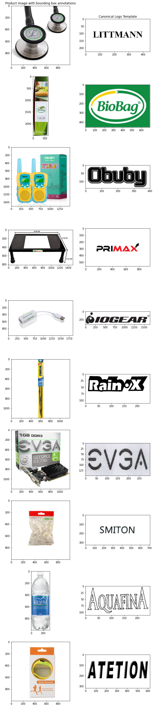
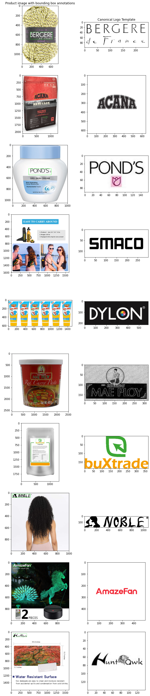

# Cross-Domain Logo Recognition Dataset

## Overview

The **Cross-Domain Logo Recognition Dataset** is designed to foster research in **cross-domain logo recognition**. This dataset provides images of logos collected from two distinct domains—**Product** and **Registration**—allowing researchers to explore domain adaptation, domain generalization, and other challenges in logo recognition.

This dataset is suitable for tasks such as:
- **Few-shot learning** for logo classification.
- **Domain adaptation** from one logo distribution (Product) to another (Registration).
- **Cross-domain retrieval** and representation learning for brand logo recognition.

## Dataset Structure

The dataset consists of images from two distinct domains:

- **Product domain**: Logos appearing on real-world product packaging, advertisements, and marketing materials.
- **Registration domain**: Logos extracted from official trademark registration records.

### Training Split
| Domain        | #Classes | #Images  | #Images per Logo |
|--------------|---------|----------|------------------|
| Product      | 9,282   | 212,381  | 22.8            |
| Registration | 9,205   | 22,196   | 2.4             |

### Validation Split
| Domain        | #Classes | #Images  | #Images per Logo |
|--------------|---------|----------|------------------|
| Product      | 1,040   | 23,246   | 22.3            |
| Registration | 1,022   | 2,352    | 2.3             |

## Key Characteristics
- **Large class diversity**: Over **9,000 unique logos** across both domains.
- **Significant domain shift**: Logos in the **Product domain** are more varied in terms of color, distortions, and real-world noise, whereas the **Registration domain** contains cleaner, official logo designs.
- **Few-shot setting for Registration domain**: The Registration domain has an average of **2.3 images per class**, making it a challenging test bed for low-data learning.

## Usage

### Data Format
- The dataset is organized by **domain** and **class labels**.
- Images are provided as **PNG/JPEG** files.

### Benchmarking
- **Baseline task**: Train/Indexing on the **Registration domain** and evaluate on the **Product domain**.

## Visualization of cross domain pairs





## Citation
If you use this dataset in your research, please cite:

```
@software{Zhao_Open_set_cross_2025,
author = {Zhao, Xiaonan and Chenge, Li},
month = feb,
title = {{Open set cross domain few shot logo recognition}},
url = {https://github.com/wacv2025-image-quality-workshop2/cross-domain-logo-recognition},
version = {1.0.4},
year = {2025}
}
```
